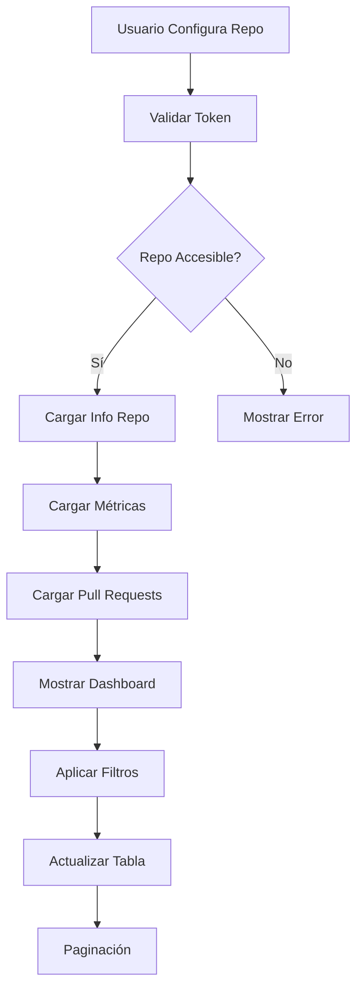

# Integración GitHub - SYSGD

## 🎯 Overview

Esta documentación describe la implementación completa de la integración entre SYSGD y la API de GitHub para monitorear Pull Requests y visualizar métricas de repositorios.

## 🏗️ Arquitectura

### Backend (Node.js + TypeScript)
- **GitHub Service**: `src/services/github.service.ts`
- **GitHub Controller**: `src/controllers/github.controller.ts`
- **GitHub Routes**: `src/routes/github.routes.ts`
- **Librería**: `@octokit/rest` para comunicación con GitHub API

### Frontend (React + TypeScript)
- **Componente Principal**: `src/components/projects/GitHubIntegration.tsx`
- **Tipos**: `src/types/GitHubTypes.ts`
- **Integración**: Agregado al sidebar de proyectos

## 📊 Modelo de Datos

### GitHubPullRequest
```typescript
interface GitHubPullRequest {
  id: number;
  number: number;
  title: string;
  state: 'open' | 'closed' | 'merged';
  created_at: string;
  updated_at: string;
  merged_at?: string;
  user: {
    login: string;
    id: number;
    avatar_url: string;
    html_url: string;
  };
  additions: number;
  deletions: number;
  changed_files: number;
  html_url: string;
  head: { ref: string; sha: string; };
  base: { ref: string; sha: string; };
}
```

### GitHubRepository
```typescript
interface GitHubRepository {
  owner: string;
  repo: string;
  full_name: string;
  description?: string;
  private: boolean;
  html_url: string;
  stargazers_count: number;
  forks_count: number;
  open_issues_count: number;
  language: string;
  created_at: string;
  updated_at: string;
}
```

## 🔌 API Endpoints

### POST `/api/github/validate`
Valida acceso a un repositorio GitHub.

**Request:**
```json
{
  "owner": "facebook",
  "repo": "react",
  "token": "ghp_xxxxxxxxxxxx"
}
```

**Response:**
```json
{
  "valid": true,
  "message": "Repository is accessible"
}
```

### POST `/api/github/repository`
Obtiene información detallada del repositorio.

### POST `/api/github/pull-requests`
Obtiene lista paginada de Pull Requests.

**Query Parameters:**
- `page`: Número de página (default: 1)
- `perPage`: Registros por página (default: 50, max: 100)
- `state`: 'open' | 'closed' | 'all' (default: 'all')
- `sort`: 'created' | 'updated' | 'popularity' (default: 'created')
- `direction`: 'asc' | 'desc' (default: 'desc')

**Response:**
```json
{
  "pullRequests": [...],
  "totalCount": 150,
  "currentPage": 1,
  "totalPages": 3,
  "hasNextPage": true,
  "hasPreviousPage": false
}
```

### POST `/api/github/metrics`
Obtiene métricas agregadas del repositorio.

**Response:**
```json
{
  "totalPRs": 150,
  "openPRs": 12,
  "closedPRs": 138,
  "mergedPRs": 125,
  "totalAdditions": 45000,
  "totalDeletions": 12000,
  "averagePRSize": 380,
  "mergeRate": 90.6
}
```

## 🎨 Frontend Features

### Configuración Inicial
- Formulario para configurar owner/repo/token
- Validación de acceso al repositorio
- Almacenamiento seguro de credenciales

### Métricas Dashboard
- Total de Pull Requests
- PRs abiertos/cerrados/mergeados
- Tasa de merge (porcentaje)
- Líneas añadidas/eliminadas

### Tabla de Pull Requests
- Paginación (50 registros por página)
- Filtros por estado, ordenamiento y dirección
- Información completa de cada PR
- Avatar del autor
- Enlace directo al PR en GitHub

### UI/UX Features
- Estados visuales con badges
- Loading states
- Manejo de errores con toast notifications
- Diseño responsivo
- Integración con el sidebar existente

## 🔐 Seguridad

### Token Management
- Los tokens se manejan exclusivamente en el backend
- No se exponen credenciales en el frontend
- Validación de permisos mínimos (public_repo)

### Autenticación
- Uso de middleware `isAuthenticated` existente
- Protección de todos los endpoints
- Integración con sistema de JWT de SYSGD

## 🚀 Instalación y Configuración

### Backend
```bash
cd server/node-server
npm install @octokit/rest
```

### Variables de Entorno
No se requieren variables adicionales. El token se proporciona por usuario.

### GitHub Token Requisitos
- Permiso: `public_repo` (para repositorios públicos)
- Permiso: `repo` (para repositorios privados)
- Sin permisos de escritura necesarios

## 📝 Uso

1. **Configurar Repositorio**:
   - Ingresar owner (ej: facebook)
   - Ingresar repo (ej: react)
   - Ingresar token de GitHub
   - Validar acceso

2. **Visualizar Métricas**:
   - Dashboard con estadísticas generales
   - Información del repositorio

3. **Explorar Pull Requests**:
   - Tabla paginada con todos los PRs
   - Filtros y ordenamiento
   - Acceso directo a cada PR

## 🔧 Características Técnicas

### Manejo de Límites de API
- Implementación básica de rate limiting
- Manejo de errores 403 (rate limit exceeded)
- Reintentos automáticos (futuro)

### Performance
- Paginación eficiente
- Caching en frontend (estado local)
- Lazy loading de datos

### Extensibilidad
- Arquitectura modular para futuras métricas
- Soporte para exportación a Excel (futuro)
- Integración con webhooks (futuro)

## 🐛 Manejo de Errores

### Backend
- Validación con Zod schemas
- Manejo de errores de GitHub API
- Respuestas estandarizadas

### Frontend
- Toast notifications para feedback
- Estados de carga
- Manejo de errores de red

## 🔄 Flujo Completo



## 📈 Métricas Disponibles

### Pull Request Metrics
- Total count
- Open/closed/merged distribution
- Average size (lines changed)
- Merge rate percentage

### Repository Metrics
- Stars and forks
- Open issues count
- Primary language
- Creation and update dates

## 🎯 Próximos Pasos (Roadmap)

### Short Term
- [ ] Exportación a CSV/Excel
- [ ] Búsqueda avanzada de PRs
- [ ] Gráficos visuales de métricas

### Medium Term
- [ ] Integración con webhooks
- [ ] Notificaciones en tiempo real
- [ ] Comparación entre repositorios

### Long Term
- [ ] Análisis de código con IA
- [ ] Predicciones de merge
- [ ] Integración con otras plataformas (GitLab, Bitbucket)

## 🤝 Contribución

Para extender esta integración:

1. **Backend**: Extender `GitHubService` con nuevos métodos
2. **Frontend**: Agregar nuevos componentes a `GitHubIntegration`
3. **Tipos**: Actualizar `GitHubTypes.ts` con nuevas interfaces
4. **Tests**: Agregar tests unitarios y de integración

---

**Nota**: Esta implementación está diseñada para ser modular y extensible, siguiendo las mejores prácticas de seguridad y rendimiento.
